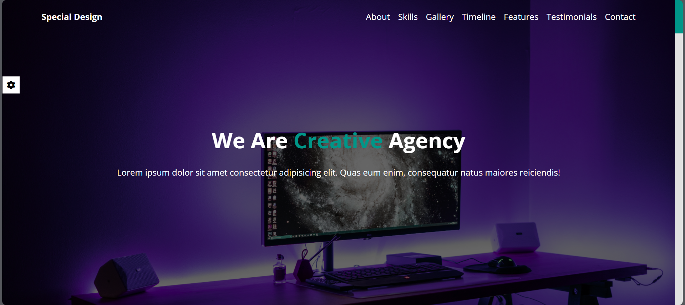
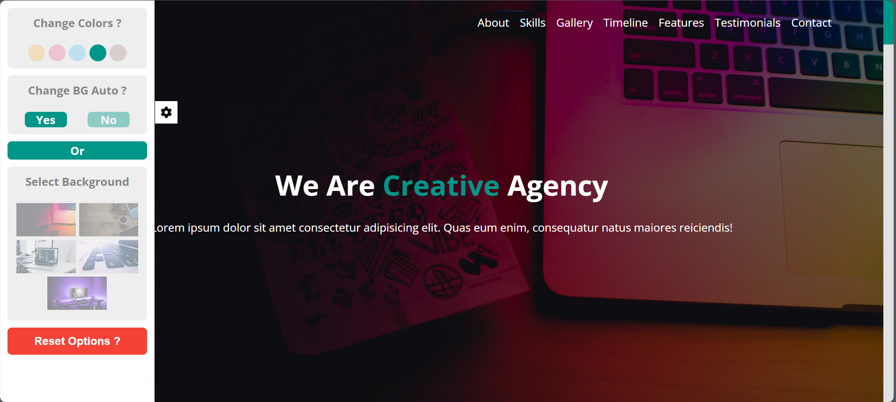
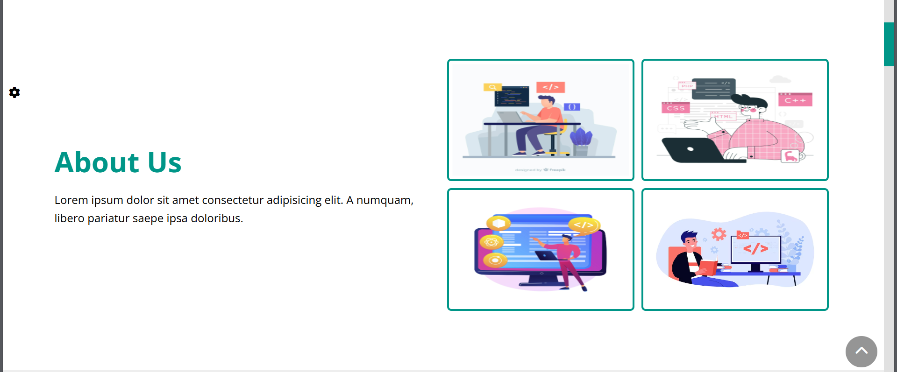
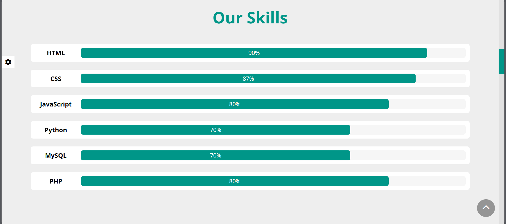
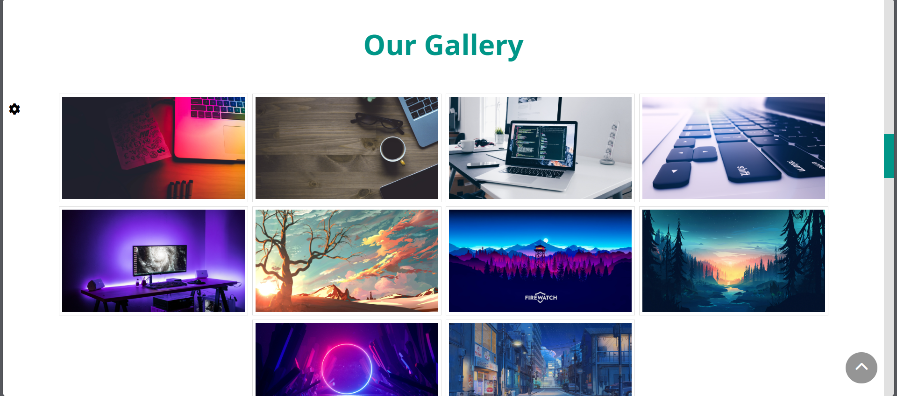
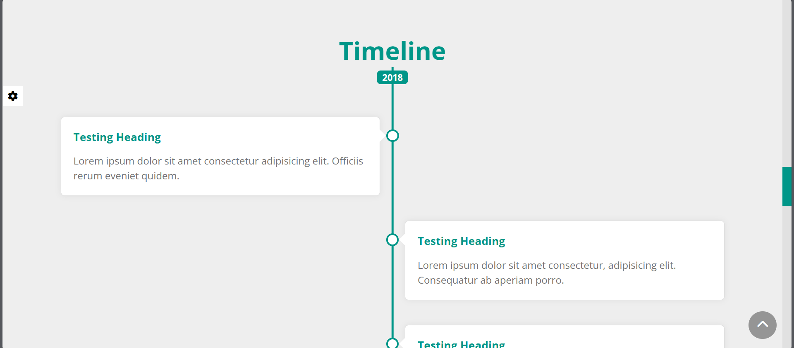
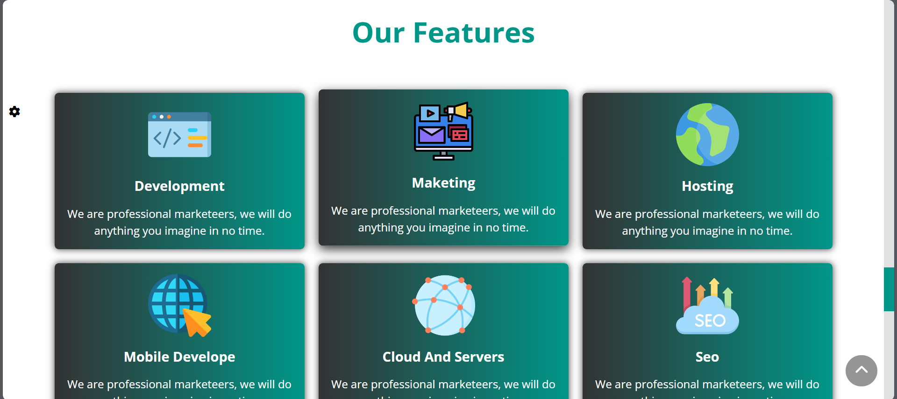
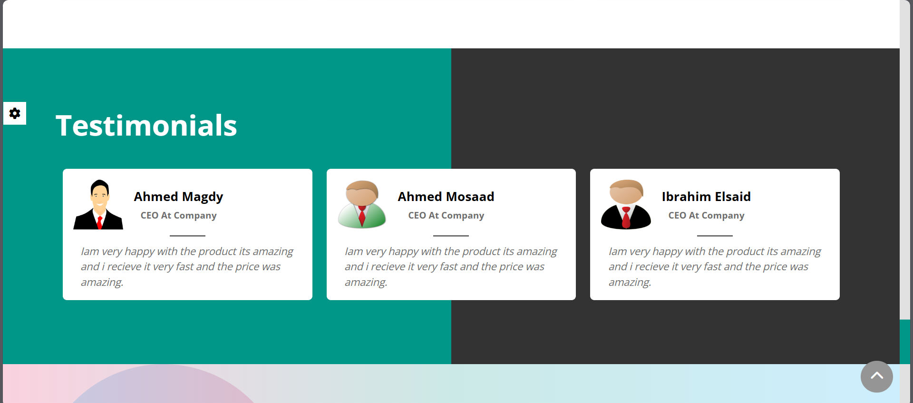
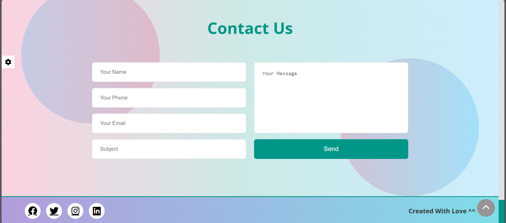

# Special-Template-With-Localstorage

## What Is This Template?

This application is an exercise on JavaScript, as it has a studio to change images for the landing section, and it also contains automatic stopping of changing images. It also supports choosing the appropriate image for you and even manipulating the design colors, changing them, and saving them, even if you close the site and open it, you will find the last modification you made.

## Who Am I ?

I'm Ahmed Magdy, I'm Front-End Developer.

## What technology is used here?

I Used Html, Css, Javascript (and Localstorage in Javascript)

### Review Site

### Landing Section

### Settings For Changing Backgrounds Or Colors

### About Section

### Our Skills Section

### Gallery Section

### Timeline Section

### Features Section

### Testimonials Section

### Contact us And Footer Sections

## Links

- Facebook
  https://www.facebook.com/profile.php?id=100085749470017

- X
  https://twitter.com/ahmed_magdy135
